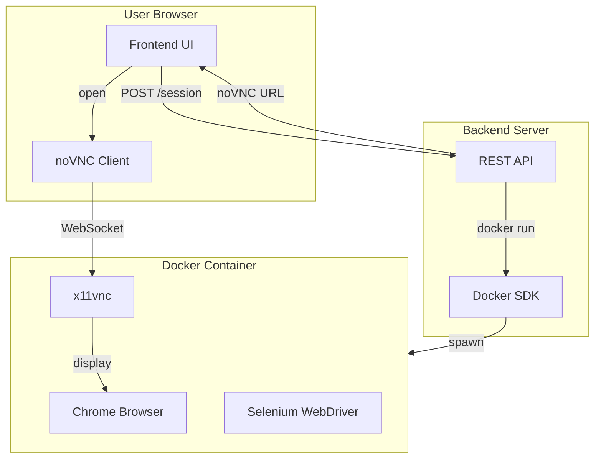

# Remote Ephemeral Browser - Phase 1 (30% MVP)

## What We're Building

A minimal working system where:

1. User clicks "Start Private Browser" on a web page
2. Backend spawns a fresh Docker container running Chrome + Selenium
3. User sees the remote Chrome streamed in their browser via noVNC
4. Container has CPU/memory limits and auto-deletes when session ends

**Deferred to later phases:** Proxy/IP variation, WebRTC (using noVNC/WebSocket first), custom Dockerfile, authentication.

---

## Architecture (30% Scope)



---

## Tech Stack

| Component | Choice                       | Rationale                                            |
| --------- | ---------------------------- | ---------------------------------------------------- |
| Backend   | Node.js + Express            | Docker SDK (dockerode) is mature; fast to prototype  |
| Frontend  | React + Vite                 | Simple SPA; easy to add iframe for noVNC             |
| Container | `selenium/standalone-chrome` | Official image with Chrome, Selenium, noVNC built-in |
| Streaming | noVNC (port 7900)            | Already in Selenium image; WebRTC can replace later  |

---

## Project Structure

```
rebrowser/
├── backend/           # Node.js API
│   ├── package.json
│   ├── src/
│   │   ├── index.js
│   │   ├── docker.js      # Container lifecycle
│   │   └── sessionStore.js
│   └── .env.example
├── frontend/          # React app
│   ├── package.json
│   ├── src/
│   │   ├── App.jsx
│   │   └── main.jsx
│   └── index.html
├── docker-compose.yml # Optional: run backend in Docker for demo
└── README.md
```

---

## Implementation Details

### 1. Backend API ([backend/src/index.js](backend/src/index.js))

- **POST /api/session** – Create new session
  - Find available host ports (e.g., 7900+offset, 4444+offset)
  - Run: `docker run -d -p {vncPort}:7900 -p {seleniumPort}:4444 --shm-size=2g -m 512m --cpus=1.0 --rm --name rebrowser-{id} selenium/standalone-chrome:latest`
  - Store session ID and container ID in memory
  - Return `{ sessionId, novncUrl, seleniumUrl }` (novncUrl = `http://localhost:{vncPort}/?autoconnect=1&resize=scale&password=secret`)
- **DELETE /api/session/:id** – End session
  - `docker stop {containerId}` (--rm will remove container)
- **GET /api/session/:id** – Session status (optional, for UI feedback)
- Use `dockerode` npm package for Docker API

### 2. Frontend ([frontend/src/App.jsx](frontend/src/App.jsx))

- Landing page with:
  - "Start Private Browser" button
  - Loading state while container spins up
  - On success: open noVNC URL in new tab (or embed in iframe)
  - "End Session" button that calls DELETE /api/session/:id
- Call backend at `VITE_API_URL` (configurable, default `http://localhost:3001`)

### 3. Port Allocation

- Backend maintains a simple port pool: base ports 7900, 4444; each new session gets `7900 + N`, `4444 + N` (N = 0, 1, 2...). Reuse freed ports.

### 4. Resource Limits (Docker flags)

- `-m 512m` – 512MB memory limit
- `--cpus=1.0` – 1 CPU core
- `--shm-size=2g` – Required for Chrome
- `--rm` – Auto-remove container on stop

---

## Key Files to Create

| File                                           | Purpose                        |
| ---------------------------------------------- | ------------------------------ |
| [backend/package.json](backend/package.json)   | express, dockerode, cors       |
| [backend/src/index.js](backend/src/index.js)   | Express server, routes         |
| [backend/src/docker.js](backend/src/docker.js) | createSession(), stopSession() |
| [frontend/package.json](frontend/package.json) | react, vite                    |
| [frontend/src/App.jsx](frontend/src/App.jsx)   | UI + API calls                 |
| [README.md](README.md)                         | Setup, run instructions        |

---

## Prerequisites

- Docker installed and running
- Node.js 18+
- `selenium/standalone-chrome` image pulled (`docker pull selenium/standalone-chrome:latest`)

---

## Run Instructions (for README)

```bash
# Terminal 1 - Backend
cd backend && npm install && npm run dev

# Terminal 2 - Frontend
cd frontend && npm install && npm run dev

# Open http://localhost:5173, click "Start Private Browser"
```

---

## Phase 2 (20%) Preview

- Custom Dockerfile with proxy support
- Proxy assignment per session
- Session timeout / auto-cleanup on inactivity

## Phase 3 (50%) Preview

- WebRTC streaming (replace noVNC)
- Authentication (e.g., Clerk)
- Persistent session store (Redis/DB)
- Cloud deployment (e.g., Railway, Fly.io)
