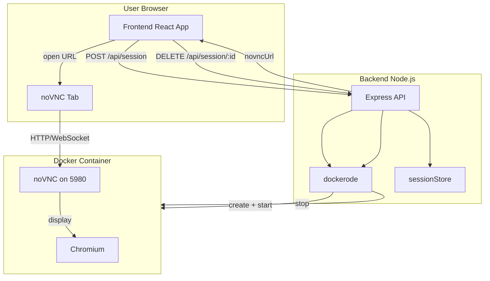
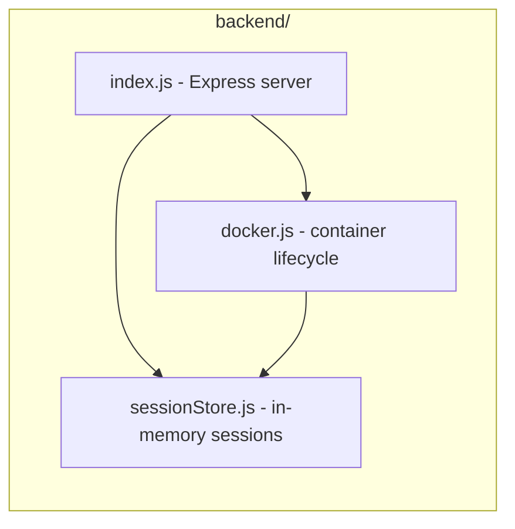
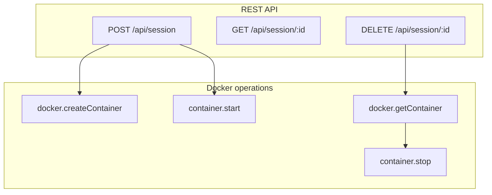
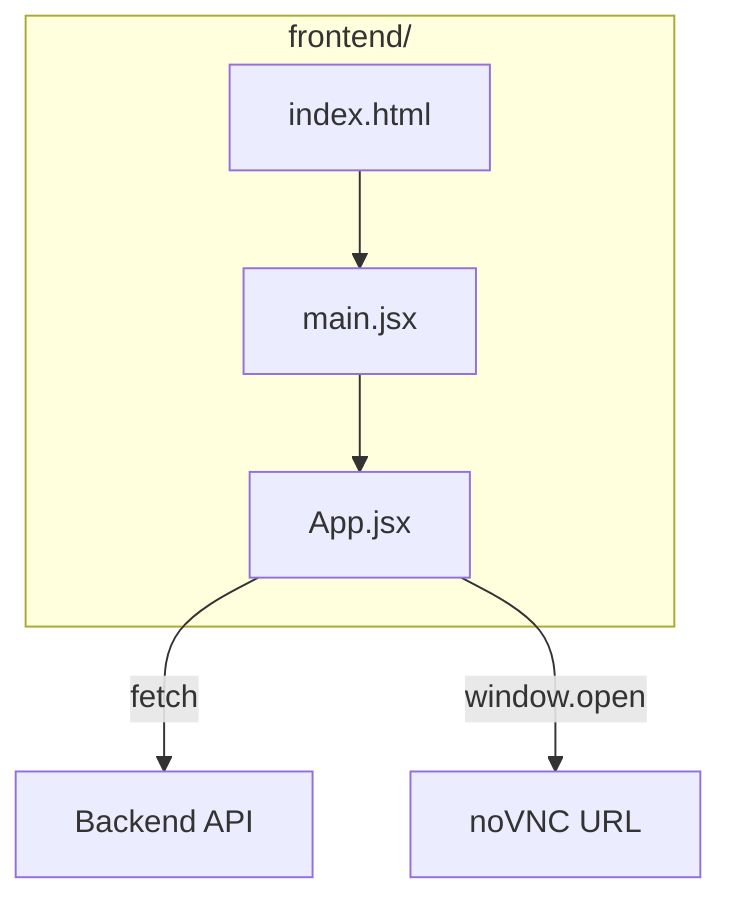

# Remote Ephemeral Browser — Project Summary & Architecture

## 1. Docker Commands Used

The app uses the **Docker Engine API** via the `dockerode` npm package (no raw `docker` CLI in code). Below are the equivalent **Docker CLI commands** and what they do.

| Command | Description | Where it's used |
|--------|-------------|------------------|
| **docker pull** | Downloads an image from a registry (e.g. Docker Hub). | Run once during setup to get `nkpro/chrome-novnc:latest`. On Apple Silicon you may need `docker pull --platform linux/amd64 nkpro/chrome-novnc:latest`. |
| **docker create** | Creates a new container from an image but does not start it. Options set image, name, env vars, port bindings, memory/CPU limits, and auto-remove. | Backend: `docker.createContainer(...)` in `backend/src/docker.js` when creating a new session. |
| **docker start** | Starts an existing container. | Backend: `container.start()` after create. |
| **docker stop** | Stops a running container. Sending a signal (e.g. SIGTERM) and waiting up to a given time (e.g. 5s) is typical. | Backend: `container.stop({ t: 5 })` when the user ends a session. |
| **docker run** | Shortcut for create + start. Our logic is equivalent to a single `docker run` with the options below. | Conceptually: one “run” per session; implemented as create then start in code. |

### Equivalent single `docker run` for one session

```bash
docker run -d \
  --platform linux/amd64 \
  --name rebrowser-<sessionId> \
  -p <hostPort>:5980 \
  -e RESOLUTION=1280x720x24 \
  -m 512m \
  --cpus=1.0 \
  --shm-size=2g \
  --rm \
  nkpro/chrome-novnc:latest
```

| Flag / option | Description |
|---------------|-------------|
| `-d` | Run in background (detached). |
| `--platform linux/amd64` | Use amd64 image (for Apple Silicon hosts). |
| `--name rebrowser-<id>` | Container name for identification. |
| `-p <hostPort>:5980` | Publish container port 5980 (noVNC) to a host port. |
| `-e RESOLUTION=1280x720x24` | Virtual display resolution (width x height x color depth). |
| `-m 512m` | Memory limit 512 MB. |
| `--cpus=1.0` | Limit to 1 CPU core. |
| `--shm-size=2g` | Shared memory size (helps Chrome run correctly). |
| `--rm` | Automatically remove the container when it stops. |

---

## 2. Project Summary

**Name:** Remote Ephemeral Browser (Docker-based isolation)

**Goal:** Provide a **disposable, isolated browser** that runs in a Docker container. The user gets a fresh environment per session, with CPU/memory limits and automatic removal when the session ends. Browsing is streamed to the user’s browser via noVNC.

**Current scope (Phase 1 baseline):**

- User clicks “Start Private Browser” in the web UI.
- Backend creates a container from `nkpro/chrome-novnc` (Chromium + noVNC).
- User receives a noVNC URL and sees the remote desktop + Chromium in a new tab.
- User browses in that isolated container; when done, “End Session” stops and removes the container (`--rm`).

**Deferred from Phase 1:** Proxy per session, WebRTC streaming, advanced multi-user orchestration.

**Tech stack:**

- **Frontend:** React + Vite; calls backend API, opens noVNC URL.
- **Backend:** Node.js + Express; uses Docker API (dockerode) to create/start/stop containers and in-memory session store.
- **Container image:** `nkpro/chrome-novnc:latest` (Chromium + noVNC; no Selenium in current build).

---

## 3. Phase 2 Implementation (Current State)

### 3.1 Authentication and Access Control

- Added email OTP authentication flow:
  - `POST /api/auth/send-otp`
  - `POST /api/auth/verify-otp`
  - `GET /api/auth/me`
- OTP is emailed via Gmail SMTP (`APP_MAIL` + `APP_PASSWORD`) with a branded HTML template.
- On successful OTP verification, backend issues JWT access token.
- Session APIs now require bearer token authentication.
- Session ownership is enforced: users can access/delete only their own sessions.

### 3.2 Security Hardening

- Added `helmet` for common HTTP security headers.
- Added CORS allowlist support via `CORS_ORIGIN`.
- Added layered rate limiting:
  - OTP send/verify per IP
  - OTP send/verify per email
  - API request limiter for protected endpoints
- Tightened JWT validation:
  - algorithm allowlist (`HS256`)
  - issuer/audience checks
  - minimum secret strength enforcement
- Added request body size limit (`10kb`) and reduced internal error leakage in API responses.
- noVNC host port binding defaults to loopback (`VNC_BIND_IP=127.0.0.1`) to reduce remote hijack risk.

### 3.3 Persistent Storage and Monitoring

- Added persistent backend runtime data path (`DATA_DIR`, mounted to Docker volume).
- OTP metadata and audit events are persisted on disk (volume-backed).
- File permissions are tightened for persisted data files.
- Added observability endpoints:
  - `GET /health`
  - `GET /metrics`
- Added structured audit events (`otp_sent`, `otp_verified`, `session_created`, `session_deleted`)
  with email hashing for safer logs.

### 3.4 Docker Compose Multi-Container Setup

- Added `docker-compose.yml` with:
  - `backend` service
  - `frontend` service
  - shared bridge network for inter-container communication
  - named volume (`backend_data`) for persistence
  - backend healthcheck and restart policies
- Added frontend production container setup with multi-stage build and Nginx.
- **Base image pins (supply-chain / scan hygiene):** backend and frontend build stages use `node:20-alpine3.22`; the frontend runtime stage uses `nginx:1.29-alpine3.22` so Alpine packages (e.g. OpenSSL, libxml2) stay on a maintained track and Trivy CRITICAL OS findings stay actionable.

### 3.5 CI and Image Reliability (GitHub Actions + GHCR)

- CI workflow builds backend and frontend Docker images, then runs **Trivy** with `severity: CRITICAL` and `ignore-unfixed: true` (fails the job only on fixable critical issues; still surfaces other severities in logs when visible).
- Workflow sets `FORCE_JAVASCRIPT_ACTIONS_TO_NODE24=true` for GitHub Actions compatibility with the Node 20 → 24 runner migration.
- Workflow is configured so:
  - Pull requests run build + scan.
  - Pushes to `main` run build + scan + push images to GHCR with `latest` and SHA tags.

---

## 4. Current Code Architecture

### High-level flow



### Backend layout



### API and Docker operations



### Frontend layout



### File roles

| File | Role |
|------|------|
| `backend/src/index.js` | Express server; defines POST/GET/DELETE `/api/session` and calls docker + sessionStore. |
| `backend/src/docker.js` | Creates container (image, platform, env, port bindings, limits, `--rm`), starts it, stops it; builds noVNC URL; uses sessionStore for session id and port. |
| `backend/src/sessionStore.js` | In-memory map of sessionId → containerId, vncPort; create/get/delete session. |
| `frontend/src/App.jsx` | UI: Start Private Browser (POST session, open noVNC URL), End Session (DELETE session), Open Browser Tab. |
| `frontend/src/main.jsx` | React root; mounts App. |
| `frontend/index.html` | Single HTML entry; mounts root div and loads main.jsx. |

---

## 5. Data flow (one authenticated session)

1. User enters email and requests OTP via `POST /api/auth/send-otp`.
2. User verifies OTP via `POST /api/auth/verify-otp` and receives JWT.
3. Frontend stores JWT locally and calls protected `POST /api/session`.
4. Backend validates JWT, ensures browser image exists (pulls if missing), creates + starts container, stores owner-scoped session metadata, and returns `sessionId` + `novncUrl`.
5. User opens `novncUrl` and interacts with isolated Chromium session.
6. User ends session with `DELETE /api/session/:id`; backend validates ownership, stops container, and removes session metadata.

This document lists Docker operations, summarizes the project, and captures the updated Phase 2 architecture with authentication, security, persistence, monitoring, and CI/container pipeline enhancements.
