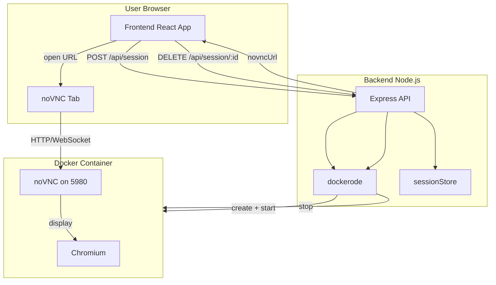
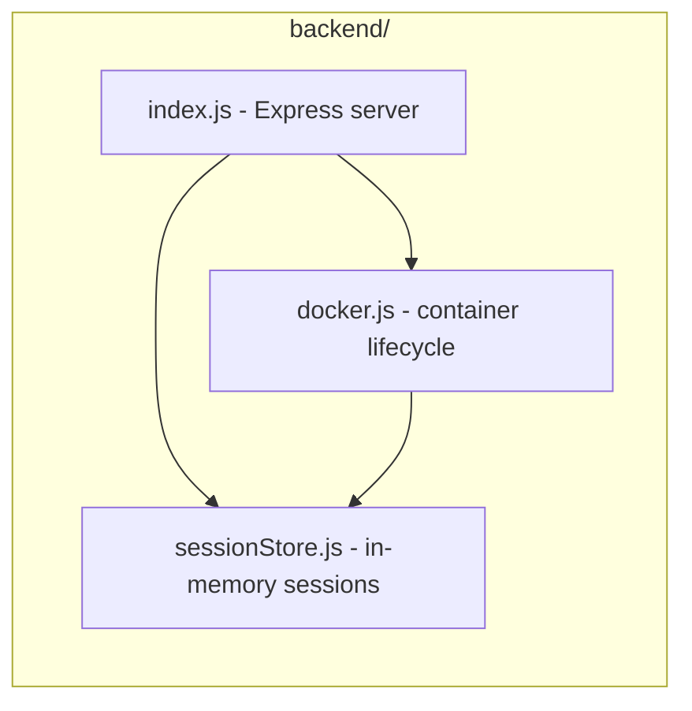
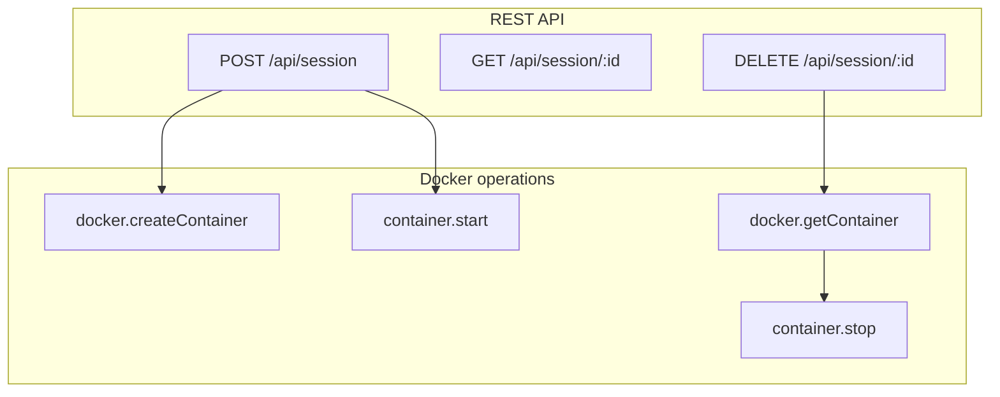
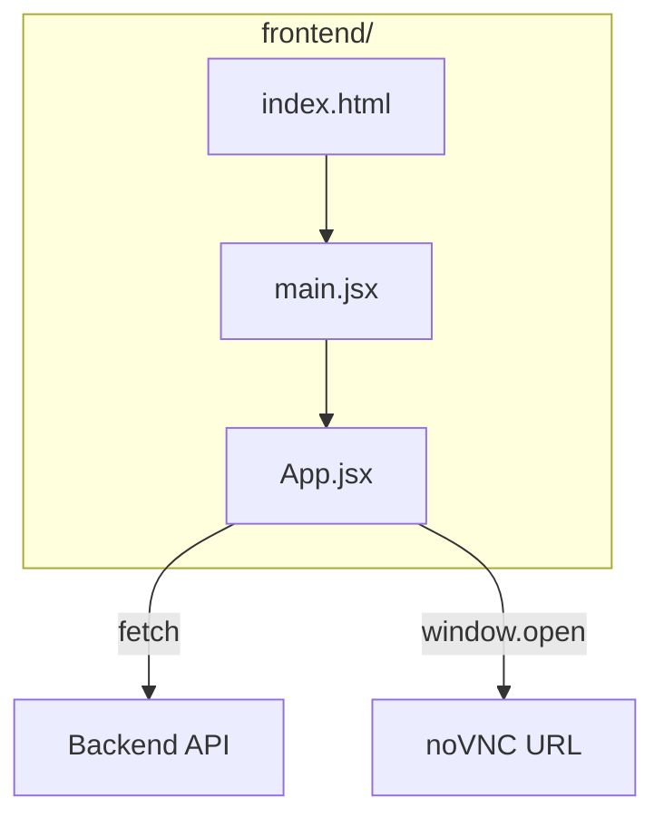

# Remote Ephemeral Browser — Project Summary & Architecture

## 1. Docker Commands Used

The app uses the **Docker Engine API** via the `dockerode` npm package (no raw `docker` CLI in code). Below are the equivalent **Docker CLI commands** and what they do.

| Command | Description | Where it's used |
|--------|-------------|------------------|
| **docker pull** | Downloads an image from a registry (e.g. Docker Hub). | Run once during setup to get `nkpro/chrome-novnc:latest`. On Apple Silicon you may need `docker pull --platform linux/amd64 nkpro/chrome-novnc:latest`. |
| **docker create** | Creates a new container from an image but does not start it. Options set image, name, env vars, port bindings, memory/CPU limits, and auto-remove. | Backend: `docker.createContainer(...)` in `backend/src/docker.js` when creating a new session. |
| **docker start** | Starts an existing container. | Backend: `container.start()` after create. |
| **docker stop** | Stops a running container. Sending a signal (e.g. SIGTERM) and waiting up to a given time (e.g. 5s) is typical. | Backend: `container.stop({ t: 5 })` when the user ends a session. |
| **docker run** | Shortcut for create + start. Our logic is equivalent to a single `docker run` with the options below. | Conceptually: one “run” per session; implemented as create then start in code. |

### Equivalent single `docker run` for one session

```bash
docker run -d \
  --platform linux/amd64 \
  --name rebrowser-<sessionId> \
  -p <hostPort>:5980 \
  -e RESOLUTION=1280x720x24 \
  -m 512m \
  --cpus=1.0 \
  --shm-size=2g \
  --rm \
  nkpro/chrome-novnc:latest
```

| Flag / option | Description |
|---------------|-------------|
| `-d` | Run in background (detached). |
| `--platform linux/amd64` | Use amd64 image (for Apple Silicon hosts). |
| `--name rebrowser-<id>` | Container name for identification. |
| `-p <hostPort>:5980` | Publish container port 5980 (noVNC) to a host port. |
| `-e RESOLUTION=1280x720x24` | Virtual display resolution (width x height x color depth). |
| `-m 512m` | Memory limit 512 MB. |
| `--cpus=1.0` | Limit to 1 CPU core. |
| `--shm-size=2g` | Shared memory size (helps Chrome run correctly). |
| `--rm` | Automatically remove the container when it stops. |

---

## 2. Project Summary

**Name:** Remote Ephemeral Browser (Docker-based isolation)

**Goal:** Provide a **disposable, isolated browser** that runs in a Docker container. The user gets a fresh environment per session, with CPU/memory limits and automatic removal when the session ends. Browsing is streamed to the user’s browser via noVNC.

**Current scope (Phase 1 / ~30%):**

- User clicks “Start Private Browser” in the web UI.
- Backend creates a container from `nkpro/chrome-novnc` (Chromium + noVNC).
- User receives a noVNC URL and sees the remote desktop + Chromium in a new tab.
- User browses in that isolated container; when done, “End Session” stops and removes the container (`--rm`).

**Deferred:** Proxy per session, custom Dockerfile, WebRTC streaming, auth, persistent session store.

**Tech stack:**

- **Frontend:** React + Vite; calls backend API, opens noVNC URL.
- **Backend:** Node.js + Express; uses Docker API (dockerode) to create/start/stop containers and in-memory session store.
- **Container image:** `nkpro/chrome-novnc:latest` (Chromium + noVNC; no Selenium in current build).

---

## 3. Current Code Architecture

### High-level flow



### Backend layout



### API and Docker operations



### Frontend layout



### File roles

| File | Role |
|------|------|
| `backend/src/index.js` | Express server; defines POST/GET/DELETE `/api/session` and calls docker + sessionStore. |
| `backend/src/docker.js` | Creates container (image, platform, env, port bindings, limits, `--rm`), starts it, stops it; builds noVNC URL; uses sessionStore for session id and port. |
| `backend/src/sessionStore.js` | In-memory map of sessionId → containerId, vncPort; create/get/delete session. |
| `frontend/src/App.jsx` | UI: Start Private Browser (POST session, open noVNC URL), End Session (DELETE session), Open Browser Tab. |
| `frontend/src/main.jsx` | React root; mounts App. |
| `frontend/index.html` | Single HTML entry; mounts root div and loads main.jsx. |

---

## 4. Data flow (one session)

1. User clicks “Start Private Browser” → frontend `POST /api/session`.
2. Backend picks a free host port, calls `createContainer` then `start`, stores session in sessionStore, returns `sessionId` and `novncUrl`.
3. Frontend opens `novncUrl` in a new tab; user sees noVNC and connects to the container’s Chromium desktop.
4. User clicks “End Session” → frontend `DELETE /api/session/:id`.
5. Backend looks up session, gets container, calls `container.stop({ t: 5 })`; with `--rm`, Docker removes the container; backend clears the session from sessionStore.

This document lists all Docker commands involved (via CLI equivalents and API usage), summarizes the project, and describes the current code architecture and data flow.
